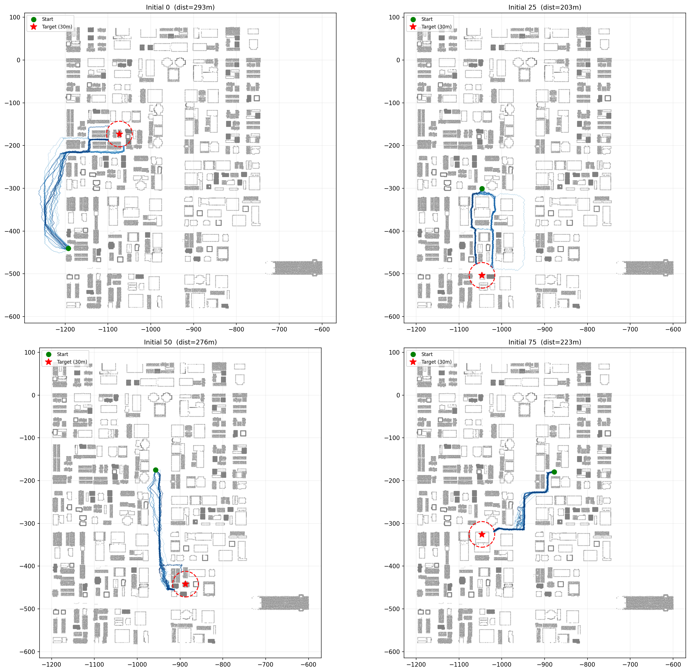

# 作业：基于强化学习的多样化轨迹采集

## 概述

训练面向无人机的视觉-语言导航（VLN）模型需要大量**多样化**的导航轨迹数据。在本次作业中，你需要实现一个强化学习智能体，在模拟城市环境中导航并采集同时满足**到达目标**和**路径多样**两个条件的轨迹。

我们提供了一个基于点云的二维城市场景和 100 组起点-目标对。你的任务是为每组起点-目标对生成至少 20 条成功轨迹，并使整体多样性分数超过给定的 baseline。你可以自由选择任何 RL 算法、奖励函数设计或探索策略。

## 动机

使用标准目标到达奖励训练的 RL 智能体往往会收敛到一条近似最优的单一路径，对同一起点-目标对反复走相同的路线。下图展示了一个 vanilla 智能体在 4 组代表性起点-目标对上采集的各 20 条轨迹：

<p align="center">

</p>

可以看到，轨迹几乎完全重合——智能体找到了一条"好路线"后就反复利用它。这是策略优化中经典的 mode collapse（模式坍塌）问题。对于下游的 VLN 模型训练，这种缺乏多样性意味着模型只能学到极为有限的导航行为。

**你的挑战是设计方法打破这种模式，在保证到达目标的同时产生有意义的不同路径。** 可能的方向包括但不限于：奖励塑形（reward shaping）、种群训练（population-based training）、隐变量条件策略（latent-conditioned policies）、熵正则化（entropy regularization），或任何你能想到的创新方法。

## 环境

环境是一个基于 [OpenFly](https://github.com/SHAILAB-IPEC/OpenFly-Platform) `airsim_16` 场景的二维导航任务。无人机在固定高度 15 m 飞行，场景以二维障碍物点云的形式表示。

| 属性 | 值 |
|---|---|
| 场景范围 | x: [-1200, -700], y: [-600, 100]（米） |
| 障碍物地图 | 你在下方"环境搭建"步骤中自行生成的二维点云 |
| 动作空间 | 二维连续位移 (dx, dy)，建议范围 [-2, 2] m/轴 |
| 成功条件 | 无人机到达目标建筑中心 **30 m** 以内 |
| 碰撞条件 | 无人机到达任意障碍物点 **2 m** 以内 |
| 回合步数上限 | 300 步 |

**观测和奖励的设计完全由你决定。** 点云和目标位置提供了足够的信息来构造任何你需要的观测和奖励。最基本的方案是在每一步查询到目标中心的相对向量和到最近障碍物点的相对向量。

## 环境搭建

### 1. Python 环境

```bash
conda create -n rl_assignment python=3.10 -y
conda activate rl_assignment
pip install torch numpy matplotlib gym
```

### 2. 点云准备

你需要为 `airsim_16` 场景制作一份二维障碍物点云。原始三维点云可从 OpenFly 项目获取。

**步骤 1 — 下载原始点云**

OpenFly 项目将场景数据托管在 HuggingFace 上。请从 [https://huggingface.co/datasets/IPEC-COMMUNITY/OpenFly](https://huggingface.co/datasets/IPEC-COMMUNITY/OpenFly) 下载 `airsim_16` 的 PCD 文件，具体步骤参见 [OpenFly README — Scene data files](https://github.com/SHAILAB-IPEC/OpenFly-Platform#toolchain)。

**步骤 2 — 使用 CloudCompare 处理**

1. 打开 CloudCompare，导入 PCD 文件（`File → Open`）。
2. **降采样**：`Edit → Subsample`，选择 **Space** 模式，设置最小点间距为 **0.5–1.0 m**。
3. **裁剪 XY 区域**：`Edit → Segment`（剪刀图标），画一个多边形框住 x ∈ [-1200, -700]、y ∈ [-600, 100] 的区域，确认保留选中的点。
4. **按高度过滤**：切换到侧视图，重复分割步骤，仅保留 z ∈ [10, 20] 的点（约 15 m 飞行高度层）。
5. **导出**：`File → Save As` → 选择 ASCII 格式（`.txt`），只保留 X 和 Y 两列。

**步骤 3 — 载入 Python**

```python
import numpy as np
points = np.loadtxt("exported_cloud.txt", usecols=(0, 1))  # (N, 2)
np.save("pointcloud_2d.npy", points)
```

### 3. 验证环境

```python
import numpy as np, json
pcd = np.load("pointcloud_2d.npy")
with open("data/eval_initials_100.json") as f:
    initials = json.load(f)
print(f"Point cloud: {pcd.shape}, Initials: {len(initials)}")
```

## 任务

### 要求

1. **实现一个 RL 智能体**（如 PPO、SAC 或任何你选择的算法），学习从起点导航到目标建筑中心。

2. **采集轨迹**：针对 `data/eval_initials_100.json` 中定义的 100 组起点-目标对，每组采集至少 **20 条成功轨迹**。

3. **最大化轨迹多样性**：你的总体多样性分数（基于 DTW 计算，见下文）必须超过 baseline 分数 **2311.29**。

### 多样性指标

多样性通过动态时间规整（DTW）距离衡量：

1. 每条轨迹首先被**重采样**为均匀弧长间隔（间距 2√2 m）。这确保了分数不受原始轨迹时间分辨率的影响——无论你的智能体使用什么步长，评估时都会统一归一化。
2. 对每组起点-目标对，计算所有 C(20, 2) = 190 条轨迹对的平均 DTW 距离。
3. 总体分数为 100 组的平均值。

官方评估代码在 `tools/compute_diversity.py` 中。**请勿修改此文件**——评分时将使用同一份代码。

### 评估起点

`data/eval_initials_100.json` 中每条记录的格式：

```json
{
  "initial_id": 0,
  "x_start": -960.6,
  "y_start": -324.55,
  "target_center_x": -936.12,
  "target_center_y": -153.19,
  "distance": 245.7
}
```

起点到目标的距离约为 200–300 m。

## 提供的文件

```
data/
  eval_initials_100.json     100 组评估起点-目标对
  baseline_trajs/            Baseline 轨迹（100 × 20）
  baseline_diversity.json    Baseline 多样性分数及元信息

tools/
  compute_diversity.py       官方多样性评估代码（请勿修改）
  evaluate_submission.py     完整提交检查器
  visualize_trajs.py         轨迹可视化工具

examples/
  baseline_visualization.png Baseline 轨迹可视化示例
```

## 提交格式

提交一个如下结构的目录：

```
submission/
  initial_0/
    traj_0.txt
    traj_1.txt
    ...
    traj_19.txt
  initial_1/
    ...
  ...
  initial_99/
    ...
```

每个 `traj_X.txt` 是一个纯文本文件，每行包含一个空格分隔的 `x y` 坐标对，代表轨迹的一个路点。

### 自我评估

```bash
cd tools

# 计算多样性分数
python compute_diversity.py \
    --trajs_dir ../submission \
    --initials_path ../data/eval_initials_100.json

# 完整检查（完整性 + 多样性 vs. baseline）
python evaluate_submission.py \
    --submission_dir ../submission \
    --initials_path ../data/eval_initials_100.json \
    --baseline_path ../data/baseline_diversity.json
```

### 可视化

```bash
python tools/visualize_trajs.py \
    --pointcloud pointcloud_2d.npy \
    --trajs_dir submission \
    --initials_path data/eval_initials_100.json \
    --initial_ids 0 25 50 75 \
    --output my_trajs.png
```

## 交付物

1. **源代码** — 完整实现，包括环境、RL 算法、训练脚本及所有工具代码。

2. **轨迹数据** — 100 个目录，每个包含 20 个轨迹文件，格式如上所述。

3. **报告**（PDF，3–5 页）—
   - 方法描述：算法选择、环境设计、奖励函数设计，以及你用于提升多样性的策略。
   - 训练分析：学习曲线和关键超参数。
   - 结果：多样性分数、与 baseline 的对比，以及至少 3 组起点-目标对的轨迹可视化。

## 评分标准

| 项目 | 权重 |
|---|---|
| 实现质量 | 20% |
| 完整性（每组 20 条成功轨迹） | 30% |
| 多样性超过 baseline | 30% |
| 报告 | 20% |

## 附加题：视觉-语言-动作模型（+20%）

利用你采集的轨迹训练一个 VLA 模型，从第一人称视角（FPV）图像预测导航动作：

1. 在 AirSim 模拟器中回放你的轨迹，在每个路点采集 FPV 图像。
2. 训练一个视觉-语言模型（例如使用 LoRA 微调 Qwen2.5-VL），输入为 FPV 图像、当前位姿和目标坐标，输出为下一步动作。
3. 报告在训练分布内和未见过的起点-目标对上的动作预测误差。

## 参考资料

- [OpenFly Platform](https://github.com/SHAILAB-IPEC/OpenFly-Platform)
- J. Schulman et al., "Proximal Policy Optimization Algorithms," arXiv:1707.06347, 2017.

---

## 教师参考资料

> **本节仅供教师使用，分发给学生前请删除。**

`_instructor/` 目录包含可选的参考材料，由教师决定是否提供给学生：

```
_instructor/
  cluster_centers.json     建筑中心坐标 {id: [cx, cy]}
  pointcloud_2d.npy        预处理好的二维点云 (99993, 2) —
                            如果学生在 CloudCompare 处理步骤遇到困难，可提供此文件

  env/
    uav_env.py             完整环境实现：
                            - 点云加载与最近点查询
                            - 4 维观测：[最近障碍物相对坐标, 目标相对坐标]
                            - 基础奖励：距离进展 + 成功奖励 (+200)
                              + 碰撞惩罚 (-100) + 步数代价 (-0.5)
                            - 基于成功次数加权的自动重置采样
    pointcloud_utils.py    点云加载与最近点查询工具

  ppo/
    ppo.py                 标准 PPO：裁剪代理目标 + 价值损失
    storage.py             基于 dict 的 rollout 存储 + GAE

  model.py                 策略网络：3 层 MLP (4→128) + actor/critic 头，
                            连续动作通过 tanh 压缩的高斯分布输出

  train.py                 训练入口：加载起点、运行 PPO 循环、
                            按提交格式保存成功轨迹

  vla_example.py           简化的 VLA 微调示例（Qwen2.5-VL + LoRA），
                            包括 ActionTokenizer、数据格式化、collate 函数
                            和 AirSim FPV 采集提示
```

**Baseline 统计：**
- 多样性分数：**2311.29**（100 组 × 20 条轨迹的平均成对 DTW，重采样至 2√2 m 间隔）
- 单组 DTW 范围：180 – 12977（中位数 1181）
- 详见 `data/baseline_diversity.json`
